# **T05: Accés Remot. Connexió via SSH**

Creem les dues màquines virtuals, una amb Windows i l’altra amb Linux (Ubuntu). Una vegada dins de la màquina virtual d'Ubuntu, executarem les següents comandes per instal·lar SSH:

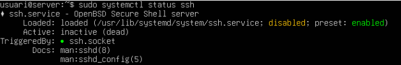 

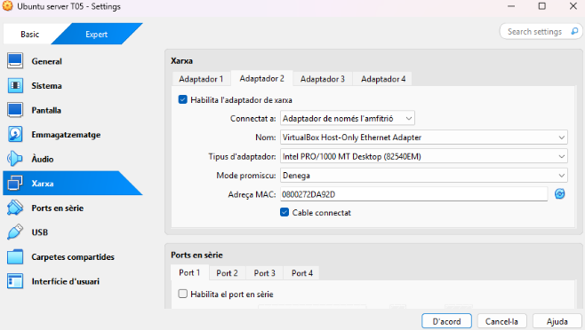

Apaguem la màquina i afegim una segona interfície en Host Only perquè les màquines es vegin entre elles.

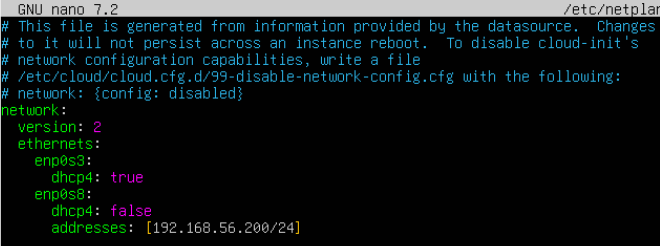

Arranquem la màquina i editem el netplan per assignar-li una IP a la interfície:  
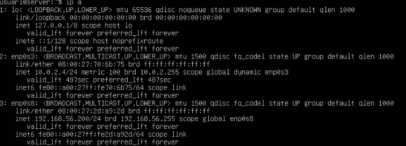

Una vegada amb l’arxiu modificat, apliquem els canvis:

\-sudo netplan apply

I comprovem que s’ha assignat correctament.  
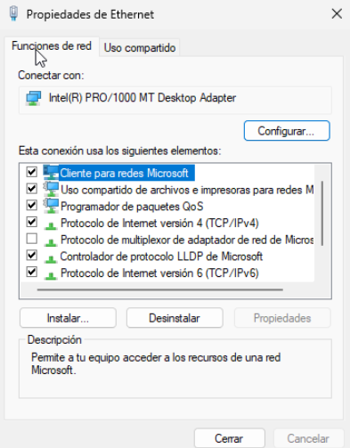

Encenem la màquina Windows i afegim la segona interfície en Host Only perquè es puguin veure les dues màquines.

A dins de Windows, ens dirigim a “Ver conexiones de red” per editar la configuració de l'adaptador i comprovem que s’ha assignat correctament.

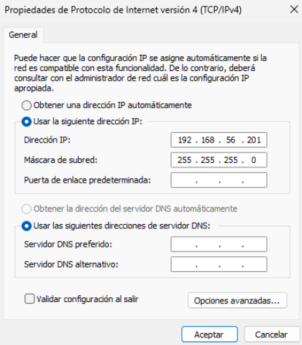 

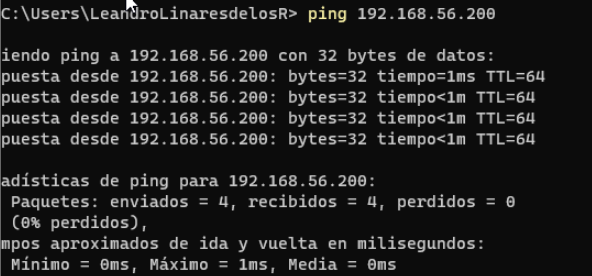

I comprovem que s’ha assignat correctament i que es veuen entre elles.  
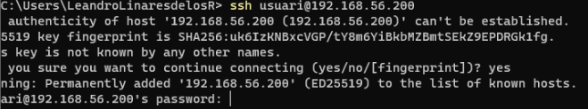 
Un cop completades les passes anteriors, ja ens podem connectar a la màquina Ubuntu des de la terminal de Windows amb:

ssh usuari@192.168.56.200

Ens apareix un missatge de seguretat ja que és la primera vegada que ens connectem, i ens demana confirmar l'autenticitat de la clau pública.

L’acceptem i ens connectem correctament, apareixent el terminal de la màquina Ubuntu.  

Un cop dins de la màquina a través de SSH, podem editar l’arxiu de configuració:

sudo nano /etc/ssh/sshd\_config

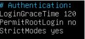

Per exemple, podem:

* Permetre o no connexions de root.  
* Canviar el port de connexió (per defecte el 22).  
* Fer una llista d’usuaris autoritzats per connexió remota.

Per deshabilitar l'accés SSH per a l'usuari root, modifiquem l’arxiu /etc/ssh/sshd\_config i canviem les següents línies.

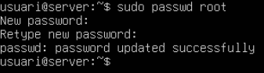

Comprovem que només es pot iniciar sessió en root localment i no per SSH. Per a fer-ho haurem de canviar la contrasenya del root amb la següent comanda:

sudo passwd root

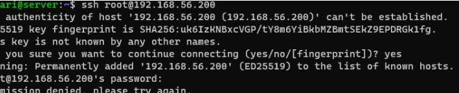

Si intentem fer SSH com a root, no ens deixarà.

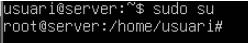

Però podem iniciar sessió de manera local sense problemes.

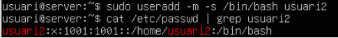

Per permetre connexió remota només a usuaris autoritzats:

Creem un nou usuari usuari2:

sudo useradd \-m \-s /bin/bash usuari2

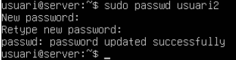

Assignem una contrasenya:

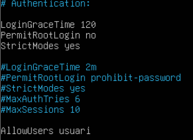

Afegim l'usuari autoritzat a l’arxiu SSH:

sudo nano /etc/ssh/sshd\_config

Afegim la línia:

AllowUsers usuari

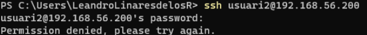

Reiniciem el servei per aplicar els canvis:

sudo systemctl restart ssh

Ara, si intentem iniciar sessió amb usuari2 no podrem, mentre que amb l’usuari usuari sí que funciona.

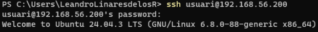

Ara com ultim pas el que farem sera accedir amb un certificat en lloc de tindre que fer servir l'usuari i contrasenya

Per fer això el primer pas sera obrir el powershell del client i escriure la seguent comanda

Un cop escrita la comanda farem enter fins que vellem algo semblant a la foto

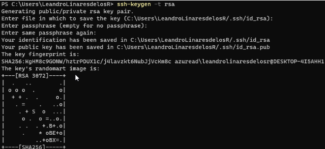

El seguent pas sera fer ls a la ruta on s'ha guardat, la ruta per defecta ens surt on la comanda d'avans, en el meu cas sera la seguent

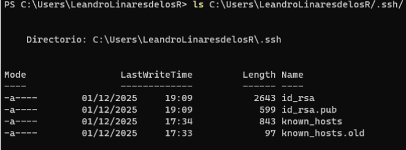

I per ultim la seguent comanda sera

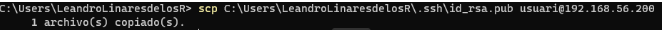

Un cop acabat això anirem al servidor ubuntu

I per començar farem les haurem de crear la carpeta ssh i un arxiu dins de la carpeta que s'anomeni authorized\_keys

És posible que aquests arxius ja estiguin creats, si ja ho estan podem ignorem aquests pas

Això ho farem de la seguent manera

mkdir .ssh

touch .ssh/authorized\_keys

A continuació farem servir la comanda ls amb la ruta que hem especificat previament, en el meu cas és

ls /home/usuari

En la qual podrem veure un archiu anomenat id\_rsa.pub

El seguent pas sera veure que hi ha dins de l'arxiu, això ho farem amb la seguent comanda

cat /home/usuari/id\_rsa.pub

Podrem veure el segunet

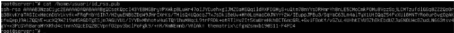

Com a ultim pas sera fer la seguent comanda

Per acabar comprobarem que tot funciona correctament

Un cop fet tot això continuarem amb Windows

# **SSH Windows**

Un cop que estem a Windows, el primer pas sera instalar el Servidor OpenSSH,

Per fer això ho farem amb la seguent comanda

Un cop fet això tocara habilitar el servei, això ho farem amb la comanda

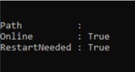

Un cop fet això reiniciem l'ordinador i arranquem el servei amb la comanda

Start-Service sshd

Si volem que el servei s'arranqui automaticament amb la seguent comanda

Set-Service \-Name sshd \-StartupType 'Automatic'

sQAAAAASUVORK5CYII=>
