**T06: Accés Remot — Escriptori Remot (RDP) (tasca individual)**

**Configuració de la màquina Windows**

Per dur a terme aquesta activitat caldrà disposar de dues màquines virtuals. La primera serà una màquina amb sistema operatiu Windows i la segona una màquina amb Zorin OS.

Un cop creades les dues màquines, el primer pas serà afegir un segon adaptador de xarxa. En aquest cas, es configurarà en mode *host-only* a totes dues màquines.

Després d’aquesta configuració inicial, començarem treballant amb la màquina Windows. El següent pas consistirà a cercar i accedir a l’opció de Configuració de l’Escriptori Remot per continuar amb el procés.

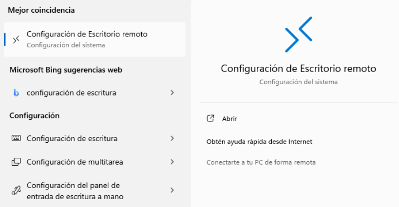

Un cop dins del menú corresponent, caldrà activar l’opció d’**Escriptori Remot**.

Aquesta configuració és necessària per poder establir una connexió remota amb la màquina Windows.

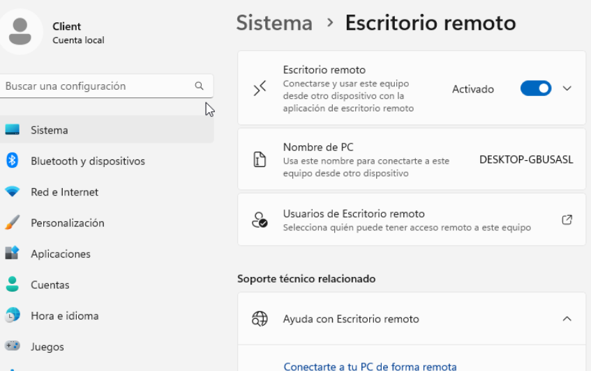

**Configuració de la màquina Zorin**

Un cop finalitzada la configuració de la màquina Windows, continuarem amb la preparació de la màquina Zorin.

Seguidament, accedirem al menú de **Configuració** per activar l’escriptori remot. Per fer-ho, primer haurem d’entrar a l’apartat de **Sistema** dins de la configuració.

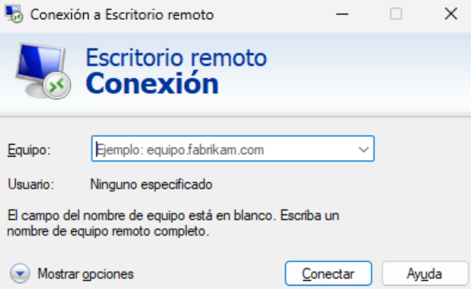

Un cop a dins, procedirem a configurar l’escriptori remot. Per començar, serà necessari activar les dues primeres opcions disponibles. Finalment, el sistema ens sol·licitarà un nom d’usuari i una contrasenya, on podrem introduir les credencials que vulguem. En aquest cas, s’utilitzarà la mateixa contrasenya que la de l’usuari.

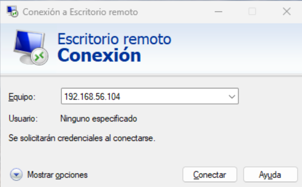

Un cop tinguem les dues màquines correctament configurades, el pas següent serà establir la connexió entre elles.

**Connexió des de la màquina Windows cap a la màquina Zorin**

Per establir la connexió amb la màquina Zorin des de Windows, utilitzarem l’eina **Connexió a l’Escriptori Remot**, que ve integrada per defecte al sistema operatiu Windows.

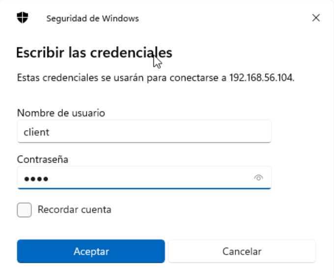

Un cop oberta l’eina, haurem d’introduir l’adreça IP de la màquina Zorin. Per conèixer aquesta IP, executarem l’ordre `ip a` des de la terminal de la màquina Zorin.

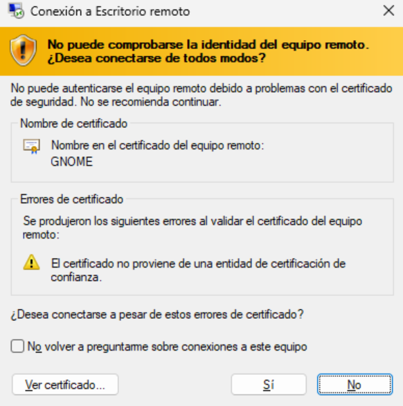
Un cop dins ens demana les credencials

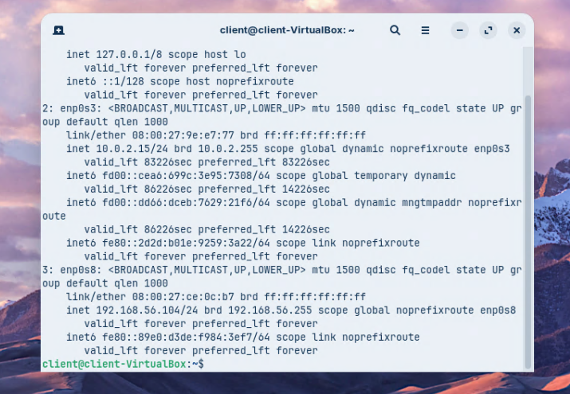

A continuació apareixerà una finestra d’advertiment relacionada amb el certificat, la qual haurem d’acceptar per poder continuar amb el procés.

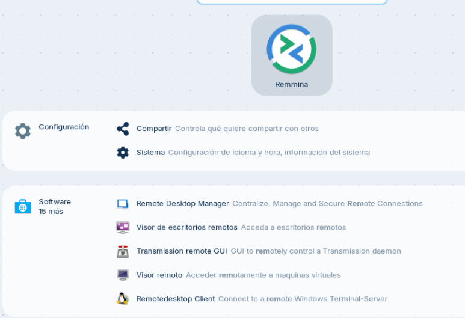

Un cop completats tots aquests passos, podrem comprovar que ja hem accedit correctament a la màquina Zorin.

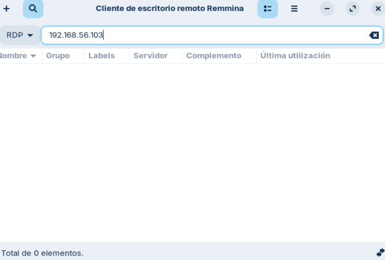

**Connexió des de la màquina Zorin cap a la màquina Windows**

Seguidament establirem la connexió des de la màquina Zorin cap a la màquina Windows. Per fer-ho, utilitzarem l’eina **Remmina**, que ja ve preinstal·lada en Zorin.

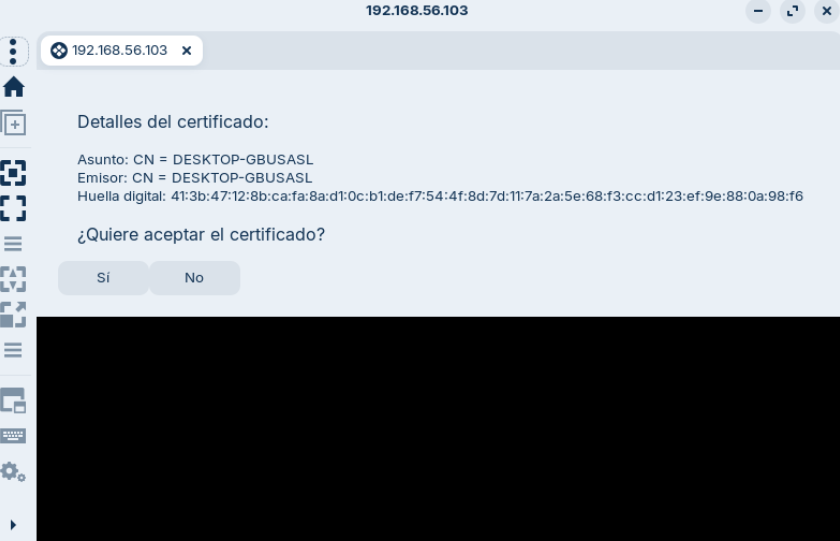

Un cop oberta l’eina Remmina, haurem d’introduir l’adreça IP de la màquina Windows. Per obtenir aquesta IP, accedirem a **PowerShell** a Windows i executarem l’ordre `ipconfig`.

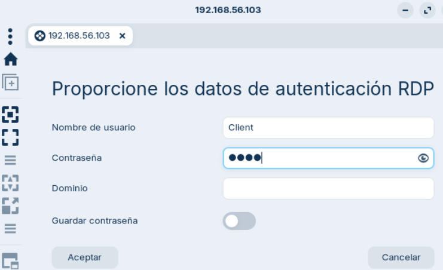

Tot seguit apareixerà una finestra d’advertiment sobre el certificat, que haurem d’acceptar per poder continuar amb la connexió.

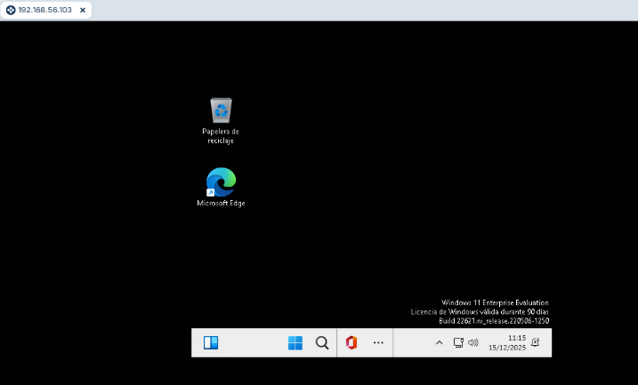

Un cop completats aquests passos, el sistema ens sol·licitarà les credencials de l’usuari.

Un cop realitzats tots aquests passos, podrem comprovar que hem accedit correctament a la màquina Windows.

