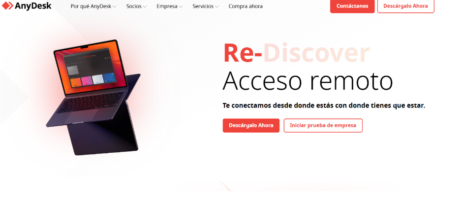
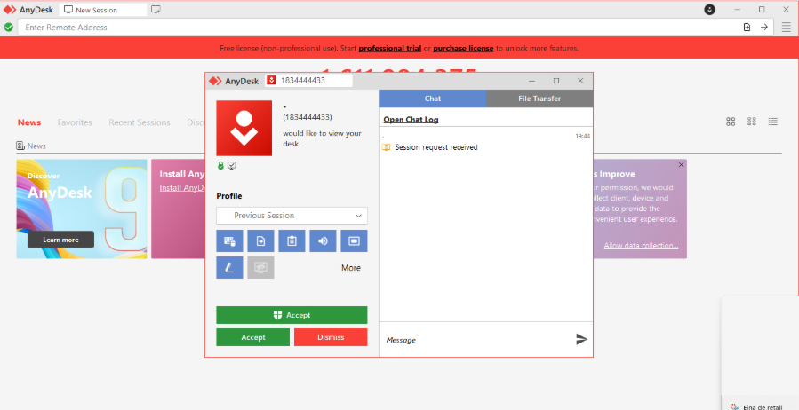
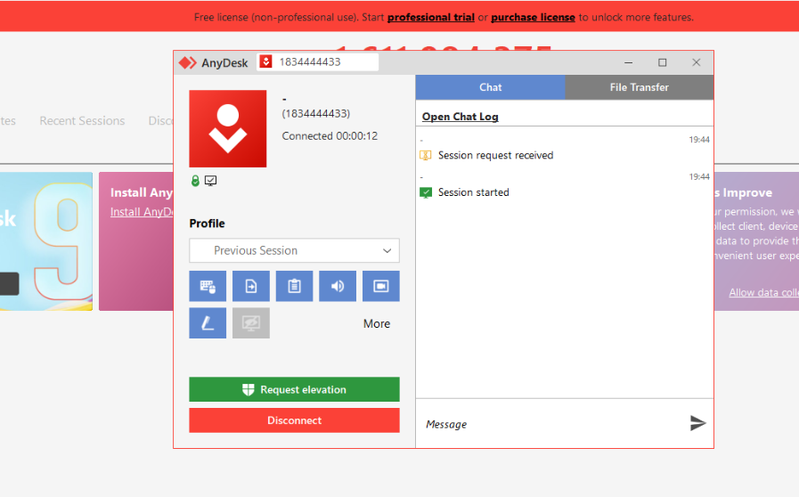

T07 Guia client

## **Fase 1: Anàlisi comparativa i selecció de la solució**

El primer pas per a EverPia és decidir quina eina d’assistència remota utilitzarem. Per fer-ho, hem comparat diferents programes molt utilitzats actualment per controlar ordinadors a distància.

Les eines analitzades han estat: **TeamViewer, AnyDesk, Google Remote Desktop** i **Chrome Remote Desktop** (com a quarta opció).

### **Taula comparativa**

| Eina | Facilitat d’ús (client) | Sistemes operatius | Model de preu |
| ----- | ----- | ----- | ----- |
| **TeamViewer** | És fàcil d’utilitzar, però s’ha d’instal·lar. El client només ha de passar un ID i una contrasenya. | Windows, macOS, Linux | Gratuït només per a ús personal. Per a ús comercial és bastant car. |
| **AnyDesk** | Molt fàcil. Es pot utilitzar sense instal·lar (portable). L’ID és fàcil de compartir. | Windows, macOS, Linux | Té versió gratuïta amb limitacions. Llicència comercial més barata que TeamViewer. |
| **Google Remote Desktop** | Molt senzill, però cal tenir compte de Google. No és tan intuïtiu per a suport puntual. | Windows, macOS, Linux | Totalment gratuït, però amb poques opcions avançades. |
| **Chrome Remote Desktop** | Fàcil d’utilitzar, però pensat més per a connexions personals que per a assistència tècnica. | Windows, macOS, Linux | Gratuït, però molt limitat per a ús professional. |

### **Recomanació**

Després de comparar les diferents opcions, **recomanem AnyDesk** com a eina d’assistència remota per a EverPia.

Aquesta eina ofereix un molt bon equilibri entre **facilitat d’ús**, **compatibilitat amb diferents sistemes operatius** i **cost**. A més, el fet que es pugui utilitzar sense instal·lació fa que sigui molt còmode per a clients que no tenen gaire coneixement informàtic. També és més econòmic que TeamViewer i més complet que les opcions gratuïtes de Google.

Per aquests motius, AnyDesk és la millor opció per a l’adopció a EverPia.

1. En primer lloc, el client ha de descarregar i executar AnyDesk al seu ordinador per poder rebre assistència remota. Per fer-ho, obre el navegador web i accedeix a la pàgina oficial d’AnyDesk mitjançant l’enllaç facilitat. Un cop dins, fa clic al botó de descàrrega i, quan l’arxiu s’ha descarregat, l’obre fent doble clic. No és necessari instal·lar el programa, ja que AnyDesk s’executa directament i queda llest per utilitzar-se en pocs segons.

Per continuar amb el procés, el client ha de facilitar al tècnic el seu ID d’AnyDesk, que apareix a la pantalla principal del programa. Aquest identificador permet que el tècnic pugui sol·licitar la connexió amb l’equip del client. Un cop el tècnic introdueix l’ID i inicia la connexió, el client rep una petició d’accés![]!

[image2](image2.png)

A continuació, el client ha d’acceptar la invitació de connexió que apareix a la seva pantalla. En acceptar-la, es permet l’accés remot al seu ordinador i s’inicia la sessió de suport, durant la qual el tècnic pot ajudar a resoldre la incidència.

Finalment, un cop establerta la connexió, es pot comprovar que la sessió s’ha iniciat correctament i que el tècnic ja té accés a l’escriptori del client per proporcionar l’assistència necessària.

