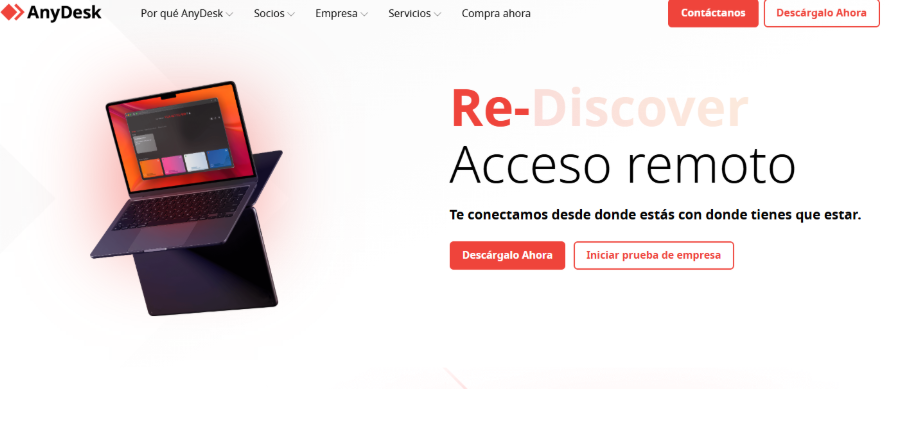
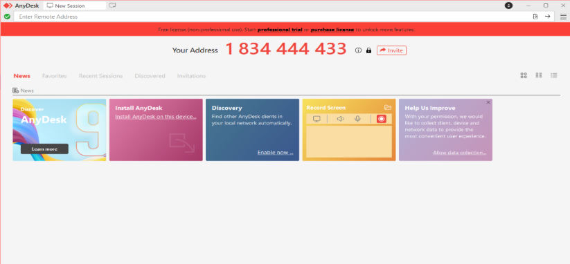
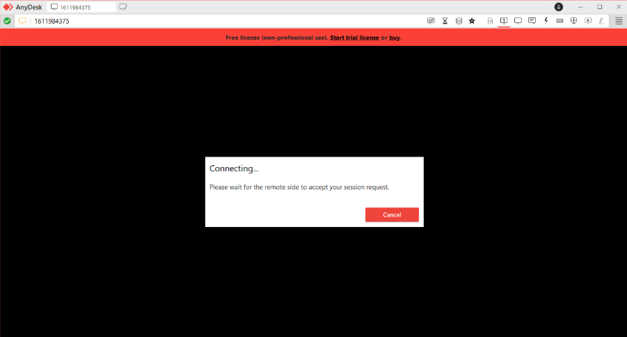
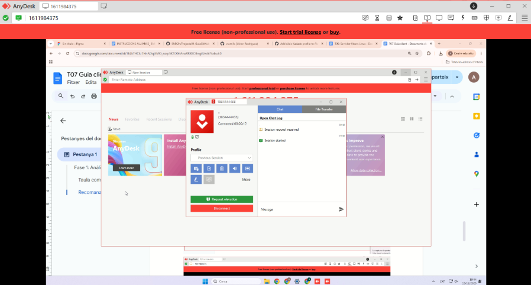

T07 Guia client

## **Fase 1: Anàlisi comparativa i selecció de la solució**

El primer pas per a EverPia és decidir quina eina d’assistència remota utilitzarem. Per fer-ho, hem comparat diferents programes molt utilitzats actualment per controlar ordinadors a distància.

Les eines analitzades han estat: **TeamViewer, AnyDesk, Google Remote Desktop** i **Chrome Remote Desktop** (com a quarta opció).

### **Taula comparativa**

| Eina | Facilitat d’ús (client) | Sistemes operatius | Model de preu |
| ----- | ----- | ----- | ----- |
| **TeamViewer** | És fàcil d’utilitzar, però s’ha d’instal·lar. El client només ha de passar un ID i una contrasenya. | Windows, macOS, Linux | Gratuït només per a ús personal. Per a ús comercial és bastant car. |
| **AnyDesk** | Molt fàcil. Es pot utilitzar sense instal·lar (portable). L’ID és fàcil de compartir. | Windows, macOS, Linux | Té versió gratuïta amb limitacions. Llicència comercial més barata que TeamViewer. |
| **Google Remote Desktop** | Molt senzill, però cal tenir compte de Google. No és tan intuïtiu per a suport puntual. | Windows, macOS, Linux | Totalment gratuït, però amb poques opcions avançades. |
| **Chrome Remote Desktop** | Fàcil d’utilitzar, però pensat més per a connexions personals que per a assistència tècnica. | Windows, macOS, Linux | Gratuït, però molt limitat per a ús professional. |

### **Recomanació**

Després de comparar les diferents opcions, **recomanem AnyDesk** com a eina d’assistència remota per a EverPia.

Aquesta eina ofereix un molt bon equilibri entre **facilitat d’ús**, **compatibilitat amb diferents sistemes operatius** i **cost**. A més, el fet que es pugui utilitzar sense instal·lació fa que sigui molt còmode per a clients que no tenen gaire coneixement informàtic. També és més econòmic que TeamViewer i més complet que les opcions gratuïtes de Google.

Per aquests motius, AnyDesk és la millor opció per a l’adopció a EverPia.

Per començar hem d'instal·lar AnyDesk, i per això:

En primer lloc, el tècnic ha d’instal·lar AnyDesk al seu ordinador. Per fer-ho, obre el navegador web i accedeix a la pàgina oficial d’AnyDesk. Un cop dins, fa clic al botó de descàrrega i, quan l’arxiu s’ha descarregat, l’executa fent doble clic. A continuació, selecciona l’opció d’instal·lar AnyDesk al dispositiu i accepta les condicions d’ús. Després d’uns segons, el programa queda correctament instal·lat i llest per utilitzar-se.

Per començar una sessió de suport, el tècnic demana al client el seu ID d’AnyDesk. Aquest identificador s’introdueix al camp anomenat “Remote Desk”. Tot seguit, el tècnic fa clic al botó de connectar i espera que el client accepti la sol·licitud. Un cop acceptada, s’estableix la connexió i el tècnic pot veure i controlar l’ordinador del client.

Una vegada fet aixó, el client haurá d’acceptar la invitació que hem enviat mediant el codi que ens ha donat, i ens connectara a la seva sessió on podrem fer el que vulguem.  

I com podem veure, ja estem dins de la sessió.

