**Projecte 04: Servidor NFS**  
 **Client: DevOptimize Solutions**

El nostre client, DevOptimize Solutions, és una startup petita dedicada al desenvolupament de programari i que treballa exclusivament amb sistemes Linux. Actualment pateixen un problema important: el codi font i tota la documentació relacionada (dissenys, scripts, fitxers auxiliars) estan distribuïts sense control en cada equip dels desenvolupadors. Això provoca conflictes de versions constants i una pèrdua de temps considerable.  
 Per aquest motiu ens han contractat per desplegar un servidor de fitxers centralitzat. Com que tot el seu entorn és Linux i no utilitzen cap sistema d’autenticació centralitzada, la millor opció és implementar **NFS (Network File System)**, una solució nativa, senzilla i eficient. El client també ha remarcat que, almenys de moment, no tenen intenció d’introduir un sistema d’autenticació centralitzat.

Per tal de presentar-los una prova de com funcionaria la proposta i també per evidenciar les seves limitacions, se’ns demana preparar una demostració funcional.

Configuraràs un servidor **NFSv3** i una màquina client Linux que accedirà als recursos compartits. També hauràs de crear usuaris i grups per imitar l’entorn del client, i així mostrar el funcionament del control d’accés amb les opcions del fitxer **/etc/exports** i els permisos del sistema (chmod, chown).

---

### **Fase 1: Preparació de l’entorn**

Per començar necessitarem dues màquines virtuals: un **Ubuntu Server** que actuarà com a servidor i un **Zorin OS** que farà de client.

Tots dos sistemes han de tenir dues interfícies de xarxa: una en mode NAT i l’altra en mode *Host-Only*.

Un cop tenen les màquines creades i funcionant, començarem configurant el servidor.  
 El primer pas és actualitzar els paquets:

`sudo apt update && sudo apt upgrade -y`

Quan tot estigui actualitzat, el següent pas serà preparar l’estructura de directoris, grups i usuaris que utilitzarem més endavant.

---

### **Fase 2: Configuració del servidor**

Començarem creant els grups necessaris. En aquest cas, se’ns demanen dos grups: **devs** i **admin**.

Les comandes per crear-los són:

`groupadd devs`  
`groupadd admin`

Per comprovar que s’han creat correctament, utilitzarem `grep` per buscar-los dentro del fitxer **/etc/group**:

`grep devs /etc/group`  
`grep admin /etc/group`

Amb això podrem verificar que els grups s’han generat amb èxit.

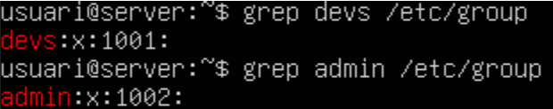

Un cop que ja tenim els grups creats el seguent pas sera crear l'usuari dev01 que formi part del grup devs, per fer això farem servir la seguent comanda

useradd \-G devs \-m \-s /bin/bash dev01

Tot seguit farem el mateix per l'usuari admin01, en la qual farem la seguent comanda

useradd \-G admin \-m \-s /bin/bash admin01

Per confirmar que estan creats correctament tornarem a fer servir el grep

grep dev01 /etc/passwd

grep admin01 /etc/passwd

Un cop que ja hem creat els grups i els usuaris, el seguent pas sera crear el directori per als projectes de desenvolupament en la qual la ruta que ens demana és la seguent /srv/nfs/dev\_projects, per crear les totes les carpetas d'una sola comanda farem el seguent:

mkdir /srv/nfs/dev\_projects \-p

Un cop fet això crearem el directori per a les eines d'administració en la qual la ruta sera /srv/nfs/admin\_tools

mkdir /srv/nfs/admin\_tools

Per ultim configurarem els permisos de les carpetas, en aquest cas seran els seguent.

Chown per canviar la propietat de la carpeta

chown root:devs /srv/nfs/dev\_projects

chown root:admin /srv/nfs/admin\_tools

Un cop fet això assignare els permisos de la carpeta amb la comanda chmod

chmod 770 /srv/nfs/dev\_projects

chmod 770 /srv/nfs/admin\_tools

Per comprobar que els permisos estan correctas farem ls \-l per poder veure els permisos de cada carpeta

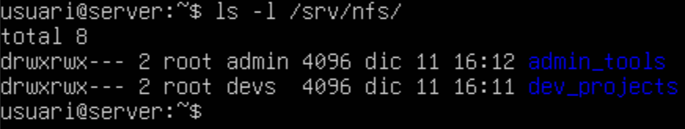

Avans de continuar amb el servidor crearem els grups i usuaris dins de la maquina client, en aquest cas una maquina zorin.

Per poder crear els grups i usuaris farem servir la aplicació "users and groups"

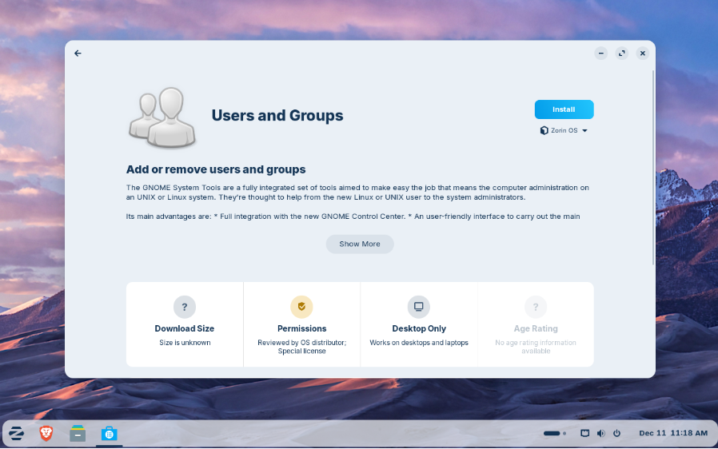

Per comporbar que tots els grups s'han creat correctament farem servir el grep tal i com hem fet avans  
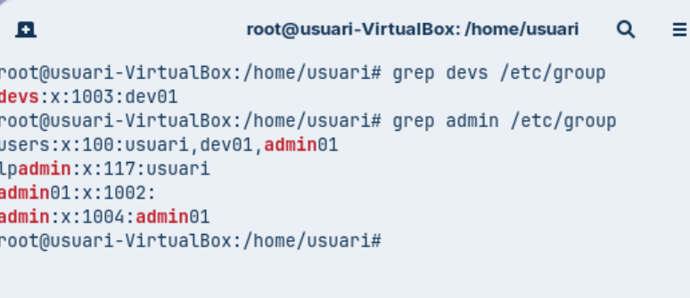
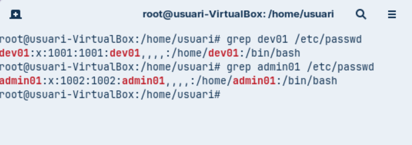

Hem de comprobar que els numeros UID i GID (els números d'identificació) coincideixin a les dues màquines.

Un cop fet això instalarem els paquets neccesairs del servei NFS al servidor, per fer això farem la seguent comanda

apt install nfs-kernel-server \-y

Per comprobar que s'ha instalat correctament podem fer un systemctl status

systemctl status nfs-kernel-server

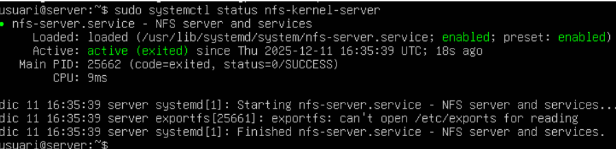

Per començar editarem l'arxiu /etc/exports per poder decidir quins arxius volem exportar, en aquest cas volem exporta tota la carpeta /srv/nfs

Afegirem una linia adicional al final del arxiu, en aquest cas sera la seguent

/srv/nfs \*(rw,sync,no\_subtree\_check)

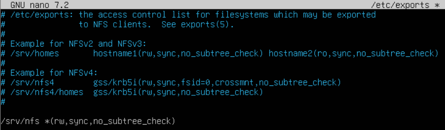

Per poder aplicar el canvis haurem de reinciar el servei amb la comanda

systemctl restart nfs-kernel-server

Un cop fet això l'iniciem i comprobarem que tot funciona correctament

En el servidor podem fer la comanda

exportfs \-u

Amb la qual podrem veure quins arxius es poden exportar

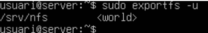

Tambe podem fer la seguent comanda per veure des-de quin port treballa, en aquest cas ho fa amb el port 2049

rpcinfo \-p 192.168.56.101

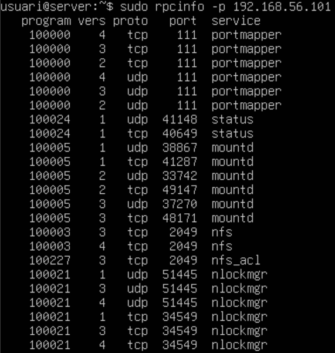

Per poder comprobar en la maquina haurem d'instalar el paquet nfs-common, això ho farem amb la seguent comanda

sudo apt install nfs-common \-y

Un cop fet això en conectarem al servidor amb la comanda showmount \-e IP

En el meu cas sera la seguent comanda

showmount \-e 192.168.56.101

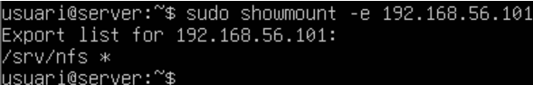

# **Fase 3: L'Exportació d'Administració (El Dilema del root\_squash)**

A continuació farem una prova 1 (L'error comú)

Previament ja hem exportat l'arxiu /srv/nfs per tant el seguent pas que hem de fer sera muntar aquest recurs a la carpeta /mnt/admin\_tools, en un principi aquesta carpeta no existeix, per tant el primer pas sera crear-la, això ho farem amb la seguent comanda

mkdir /mnt/admin\_tools

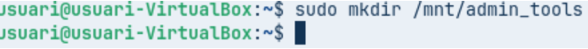

Podrem veure no podem crear cap arxiu ja que no tenim els pemisos ja que el root de la maquina client i el root del servidor no es el mateix

Mentre que si intentem crear un arxiu amb l'usuari admin si que podrem, ja que aquest usuari si que te permisos en aquesta carpeta

Podem veure que l'arxiu que hem creat es propietat de admin01

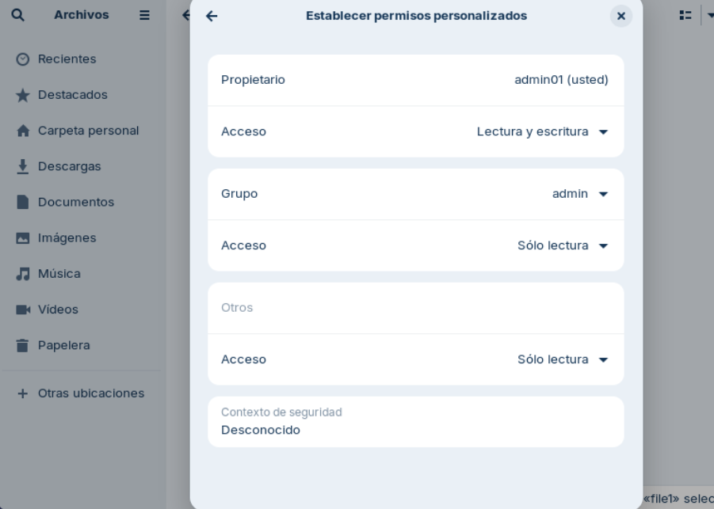

A continuació ensenyare com fer per poder crear arxius amb root

Prova 2 (La Solució)

Per començar haurem d'editar l'arxiu /etc/exports en el qual substituirem la linia que hem escrit previament per les seguents.

/srv/nfs/admin\_tools \*(rw,sync,no\_subtree\_check,no\_root\_squash)

/srv/nfs/dev\_projects \*(rw,sync,no\_subtree\_check)

Un cop fet això reiniciem el servei un altre cop amb la comanda

systemctl restart nfs-kernel-server

A continuació haurem de desmuntar i muntar un altre cop el recurs, en el meu cas la comanda per desmuntar sera

umount \-t nfs 192.168.56.101:/srv/nfs/admin\_tools /mnt/admin\_tools

I per muntar

mount \-t nfs 192.168.56.101:/srv/nfs/admin\_tools /mnt/admin\_tools

Un cop fet això podrem crear un now arxiu, per exemple en aquest cas he creat una arxiu anomenat file2

Això a causa de que hem modificat l'arxiu /etc/exports fent que el root de la maquina fisica sigui el mateix que el root del servidor, per tant tenim total llibertat

---

# **Fase 4: L'Exportació de Desenvolupament (Permisos rw vs ro)**

A continuació el client ens demana el seguent la xarxa d'administració (p.ex., 192.168.56.0/24) hi pugui escriure, però que la xarxa de consultors (p.ex., 192.168.56.100) només pugui llegir.

Per poder fer això haurem de modificar l'arxiu /etc/exports i substituir la linia "/srv/nfs/dev\_projects \*(rw,sync,no\_subtree\_check)" per les seguents

/srv/nfs/dev\_projects 192.168.56.0/24(rw,sync,no\_subtree\_check)

/srv/nfs/dev\_projects 192.168.56.100/24(ro,sync,no\_subtree\_check)
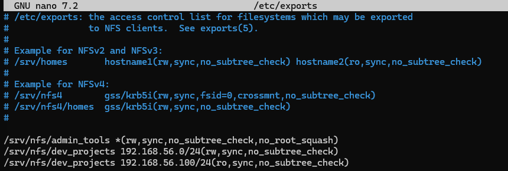

Això ho fem per poder assignar permisos depened de la ip que tingui l'usuari

Tot seguit reinciem el servei amb la comanda

systemctl restart nfs-kernel-server
Un cop fet això haurem de muntar el disc dev_projects per comprobar que tot funciona correctament.

El primer pas sera crear la carpeta amb la seguent comanda

mkdir /mnt/dev_projects
El seguent pas que farem sera modificar la nostre ip, en aquest cas probarem amb la ip 192.168.56.103 per poder fer això anirem a la configuració de xarxa i colocarem la ip manualment i muntarem el disc

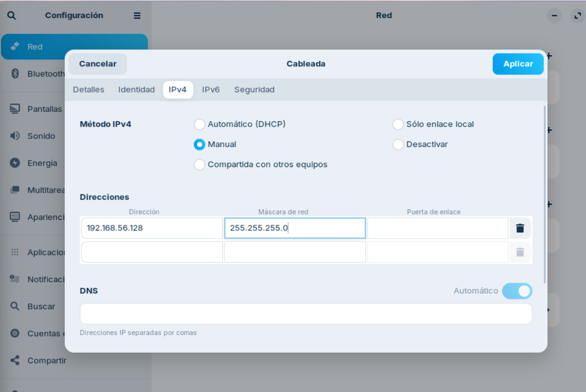

Un cop fet això si fem login l'usuari dev01 com que tenim una ip dins del rang que pot editar dins de la carpeta si que podrem crear arxius

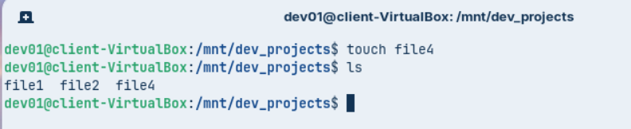

Mentre que canviem la ip i coloquem per exemple 192.168.56.102 podrem observar que no podem editar els arxius però si que podem veure que hi ha a la carpeta, haurem de tornar a desmuntar i muntar el disc

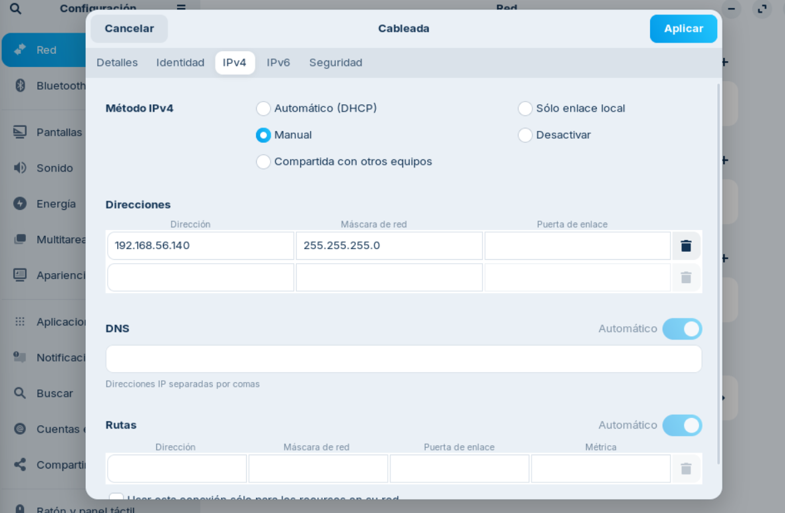
